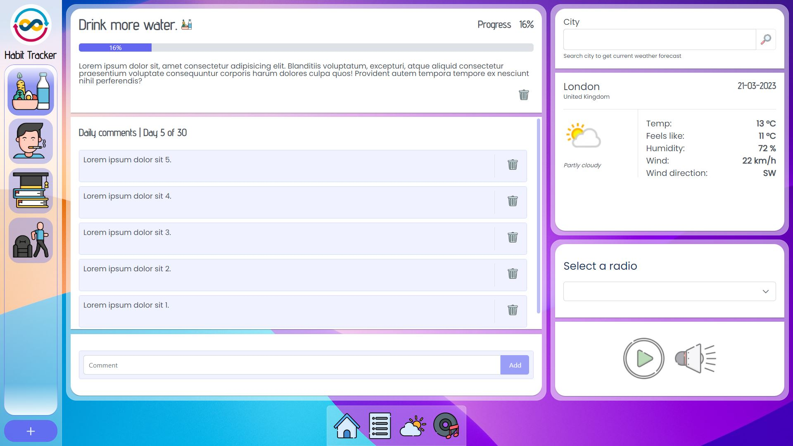
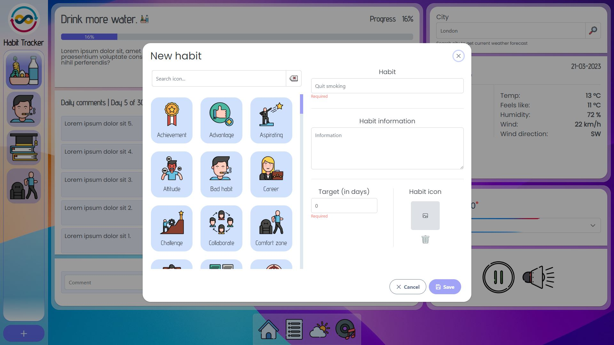
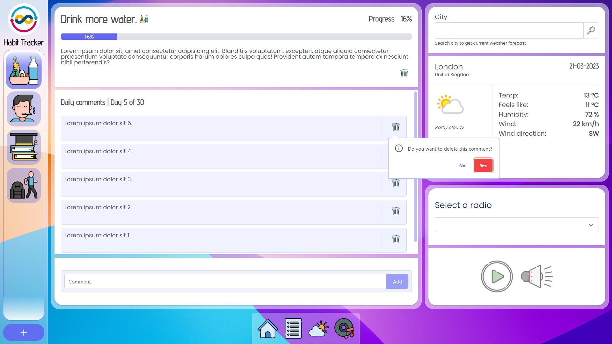
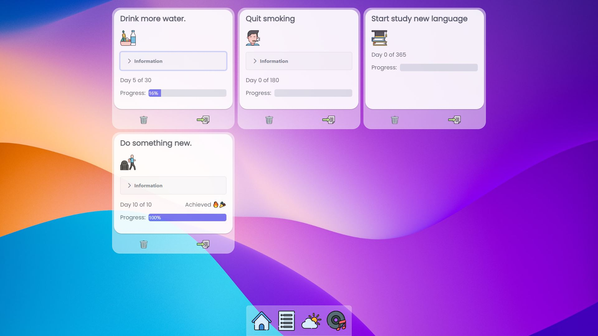
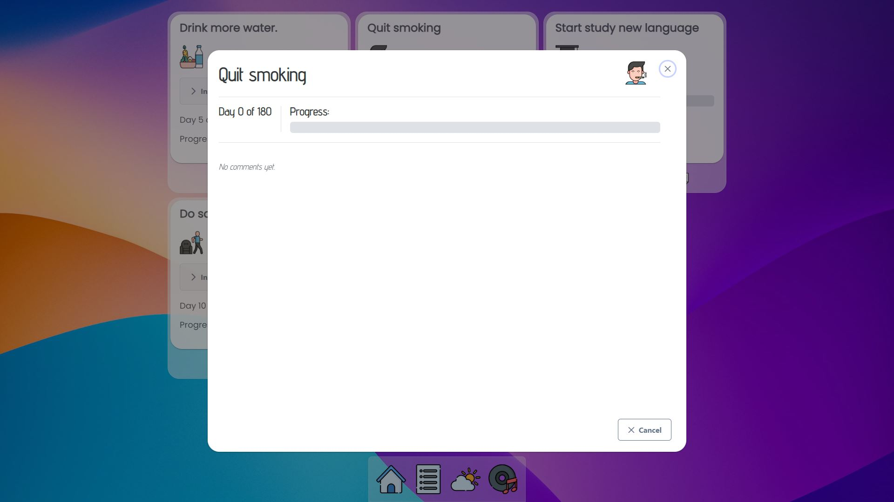
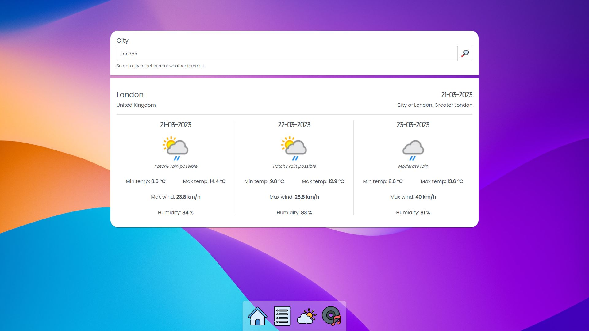
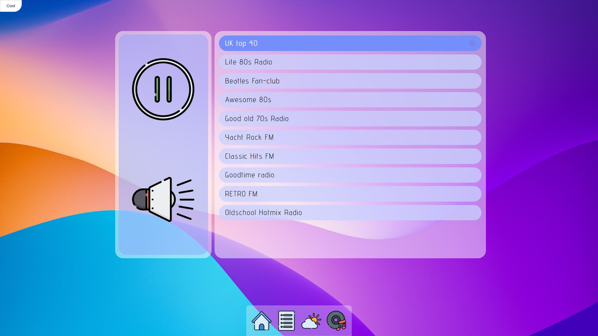
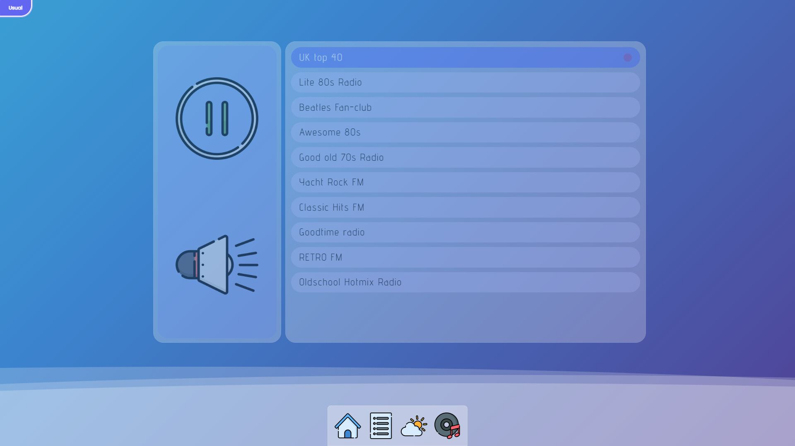

# Habit Tracker

**Main screen**

**Habits screen**

**Weather screen**

**Radio screen**

To install und run the project:

 ### `1. npm install`
 ### `2. npm run dev`

Disclaimer: Please note that this project is for demonstrational and educational purposes only.